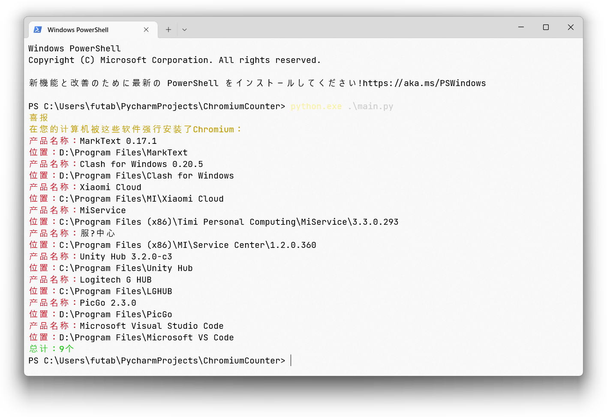

# Chromium Counter
 
Electron 计数器，看看你的电脑上有多少套壳浏览器😎

## 原理

经过研究发现，使用航天框架编写的程序在主目录下都会有 `LICENSES.chromium.html` 和 `LICENSE.electron.txt` 或者以 `chrome` 开头的文件，通过这种方式我们可以很快地辨认出该应用程序是否使用了航天框架。

脚本使用遍历的方式，先遍历注册表本机所有已安装应用的目录，再至根目录遍历文件，如果发现有 `LICENSES.chromium.html` 或者以 `chrome` 开头的文件，那么就认为该应用程序使用了航天框架。

当然该方式并不是很准确，因为有些应用程序可能会在根目录下放置这些文件，或者不在注册表内登记安装记录（例如，QQ 频道，以及使用 scoop 等包管理器安装的应用程序），但是这种情况应该不多，暂且搁置。
## 用法

脚本完全基于 Python 标准库编写，不需要任何其他依赖，该脚本只能运行于 Windows 上。

```shell
clone https://github.com/mitian233/ChromiumCounter.git
cd ChromiumCounter
python.exe main.py
```
